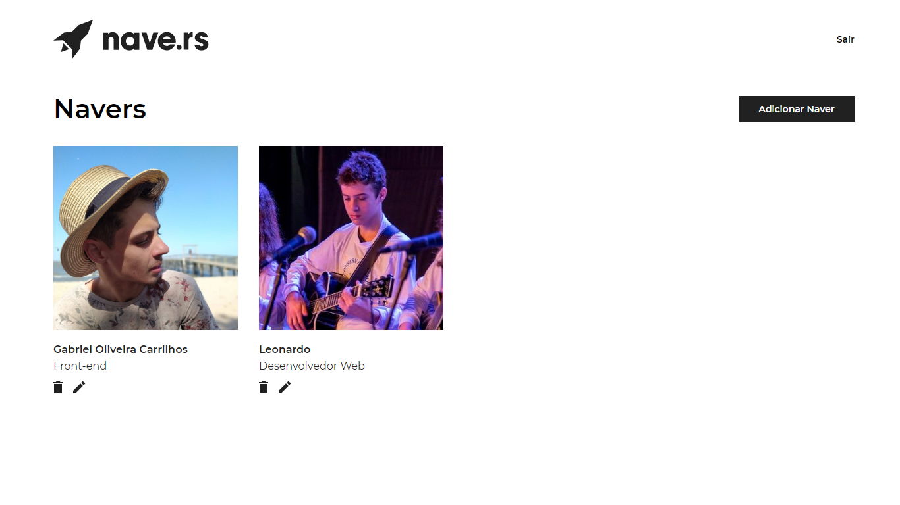

# Navedex

Web app para a visualização e criação dos navers, possuindo informações como: nomes, idades, cargos, tempo de empresa e projetos que participou.

## Instalando

Realize um clone do respositório, execute ```yarn``` e logo após ```yarn start``` para iniciar o projeto.

## Preview das telas





